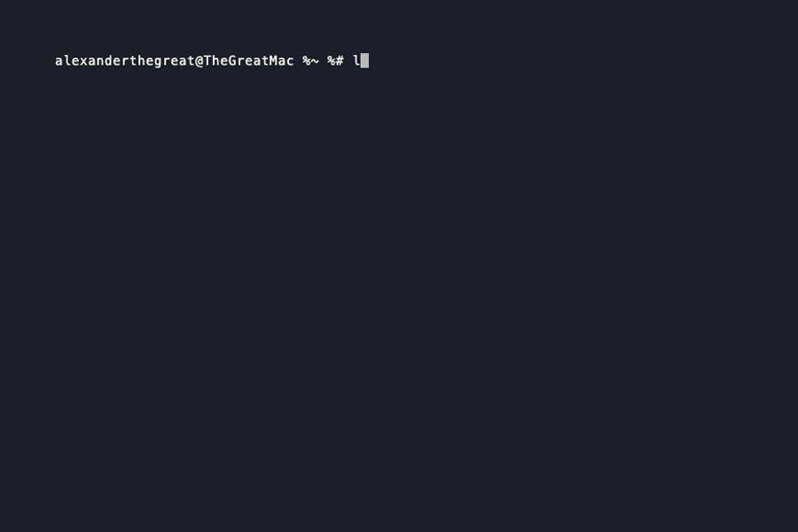

# LocalCode v3

**Local-first, open-source AI coding assistant for your terminal.**
Supports Ollama (free, fully local), Claude, OpenAI, and Groq — with a rich TUI inspired by Claude Code.



[](https://www.npmjs.com/package/@localcode/cli)
[](https://www.npmjs.com/package/@localcode/cli)
[](https://marketplace.visualstudio.com/items?itemName=LocalCodeByTheAlxLabs.localcode)
[](https://github.com/thealxlabs/localcode/stargazers)
[](LICENSE)

```
 /\_/\   LocalCode  v3.1.0  ·  open source
( ·.· )  provider  Ollama  qwen2.5-coder:7b
 > ♥ <   cwd       ~/my-project
         tokens    0  ░░░░░░░░░░  0%
```

---

## Install

**One-liner:**
```bash
curl -fsSL https://raw.githubusercontent.com/thealxlabs/localcode/main/install.sh | sh
```

**npm:**
```bash
npm install -g @localcode/cli
localcode
```

**Run without installing:**
```bash
npx @localcode/cli
```

**VS Code extension:** search `LocalCode` in the Extensions panel, or [install from Marketplace](https://marketplace.visualstudio.com/items?itemName=LocalCodeByTheAlxLabs.localcode).

**Build from source:**
```bash
git clone https://github.com/thealxlabs/localcode.git
cd localcode
npm install && npm run build
npm link
```

---

## Providers

| Provider | Requires Key | Default Model | Notes |
|---|---|---|---|
| **Ollama** | No | `qwen2.5-coder:7b` | Free, fully local |
| **Claude** | Yes | `claude-sonnet-4-5` | Best model quality |
| **OpenAI** | Yes | `gpt-4o` | Strong general coding |
| **Groq** | Yes | `llama-3.3-70b-versatile` | Very fast inference |

### API Key Setup

```bash
# Environment variables (recommended)
export ANTHROPIC_API_KEY=sk-ant-...
export OPENAI_API_KEY=sk-...
export GROQ_API_KEY=gsk_...

# Or inside the app
/apikey sk-ant-...
```

---

## Features

### Multi-provider with live switching
Switch providers and models at runtime — no restart needed.
```
/provider claude       → switch to Claude
/model claude-opus-4-6 → change model instantly
```

### Fully local with Ollama
Run 100% offline and free. Install [Ollama](https://ollama.com), pull a model, and go:
```bash
ollama pull qwen2.5-coder:7b
localcode
```

### Agent loop with tool use
Nyx (the AI assistant) can read, write, patch, delete, and move files, run shell commands, search codebases, and operate git — all in an autonomous agent loop.

Built-in tools:
- `read_file` / `write_file` / `patch_file` / `delete_file` / `move_file`
- `list_dir` — list directory tree
- `search_files` — grep-style search across codebase
- `find_files` — find files by name pattern
- `run_shell` — execute shell commands
- `git_operation` — run git commands

### Approval modes
Control how much the agent can do autonomously:

| Mode | Behavior |
|---|---|
| `suggest` (default) | Prompt before every file write, delete, or shell command |
| `auto-edit` | File edits auto-approved; only shell commands need approval |
| `full-auto` | Everything runs without prompting |

```
/mode auto-edit
/allowall        <- cycles through modes
```

### Rich slash command system
Type `/` to open the searchable command picker. All commands:

**Session**
| Command | Description |
|---|---|
| `/clear` | Clear conversation |
| `/compact` | Summarize & compress conversation |
| `/checkpoint [label]` | Save a checkpoint |
| `/restore [id]` | Restore a checkpoint |
| `/retry` | Regenerate last response |
| `/copy` | Copy last response to clipboard |
| `/export [name]` | Export conversation to markdown |
| `/undo` | Undo last file change |
| `/status` | Show session info |
| `/exit` | Save and exit |

**Agent Control**
| Command | Description |
|---|---|
| `/mode <mode>` | Set approval mode |
| `/allowall` | Cycle approval mode |
| `/steps <n>` | Set max agent steps (default: 20) |

**Context & Memory**
| Command | Description |
|---|---|
| `/context <path>` | Add file or directory to context |
| `/pin <text>` | Pin text that persists through `/compact` |
| `/unpin [n]` | Remove pinned context |
| `/web <query>` | Search the web and inject results |
| `/todo` | Extract todo list from conversation |
| `/open <file>` | Open file in `$EDITOR` |
| `/diff [file]` | Show unified diff of session changes |

**System & Personas**
| Command | Description |
|---|---|
| `/sys [prompt]` | View or set the system prompt |
| `/persona [name]` | Switch AI persona |

Built-in personas: `pair-programmer`, `senior-engineer`, `rubber-duck`, `code-reviewer`, `minimal`

**Git**
| Command | Description |
|---|---|
| `/commit` | AI-generated conventional commit |
| `/review` | AI code review of staged/working changes |

**Navigation (quick tools, no AI needed)**
| Command | Description |
|---|---|
| `/cd <path>` | Change working directory |
| `/ls [path]` | List directory |
| `/search <pattern>` | Grep file contents |
| `/find <pattern>` | Find files by name |

**Providers & Models**
| Command | Description |
|---|---|
| `/provider [name]` | Switch provider |
| `/apikey <key>` | Set API key |
| `/model <name>` | Change model |
| `/models` | List available models |
| `/cost` | Show estimated session cost |
| `/ping` | Test provider connectivity and latency |

**Tools & Diagnostics**
| Command | Description |
|---|---|
| `/init` | Generate `.nyx.md` project config from codebase |
| `/doctor` | Health check: Ollama, API keys, git, memory, MCP |
| `/memory [edit]` | Show and manage `.nyx.md` memory files |
| `/hooks` | Show configured hooks |
| `/mcp <subcommand>` | Manage MCP servers |

---

## Keyboard Shortcuts

| Shortcut | Action |
|---|---|
| `Up` / `Down` | Navigate input history |
| `Escape` | Cancel in-flight AI request |
| `Ctrl+E` | Toggle multiline input mode |
| `Ctrl+D` | Submit multiline input |
| `Ctrl+C` | Save session and exit |
| `/` | Open command picker |

---

## Context Injection

Inject file or directory content inline in any message using `@`:

```
What's wrong with @src/app.ts?
Summarize the structure of @src/
```

Or use the slash command:
```
/context src/utils/
```

---

## Memory Files (`.nyx.md`)

Nyx loads memory files at startup and prepends them to every request:

| File | Scope |
|---|---|
| `~/.nyx.md` | Global — always loaded |
| `<project>/.nyx.md` | Project — loaded when cwd matches |

Generate a project memory file automatically:
```
/init
```

Edit your global memory:
```
/memory edit
```

---

## Hooks

Run shell commands before/after tool calls using `~/.localcode/hooks.json`:

```json
{
  "PreToolUse": [
    { "matcher": "write_file", "command": "echo 'Writing $LC_TOOL_PATH'" }
  ],
  "PostToolUse": [
    { "matcher": "write_file", "command": "prettier --write \"$LC_TOOL_PATH\" 2>/dev/null" }
  ],
  "Notification": [
    { "command": "say done" }
  ]
}
```

**Environment variables available in hooks:**
- `LC_TOOL_NAME` — name of the tool called
- `LC_TOOL_ARGS` — JSON args
- `LC_TOOL_OUTPUT` — tool output (PostToolUse only)
- `LC_TOOL_PATH` — file path arg if applicable

---

## MCP (Model Context Protocol)

Connect external tool servers via [MCP](https://modelcontextprotocol.io):

```
/mcp add my-server stdio npx -y @my-org/mcp-server
/mcp add my-api http https://api.example.com/mcp
/mcp list
/mcp tools
```

---

## Multiline Input

For large prompts, code pastes, or long instructions:

1. `Ctrl+E` — enter multiline mode (numbered line editor)
2. `Enter` — add a new line
3. `Ctrl+D` — submit
4. `Ctrl+E` again — cancel and discard

---

## Auto-save

Session state is saved automatically after each AI response and on exit to `~/.localcode/session.json`. Persisted settings:

- Provider and model
- API keys
- Approval mode
- Max agent steps
- System prompt and persona
- Pinned context
- Checkpoints

---

## Security

- **Path traversal protection** — all file operations are sandboxed to the working directory
- **No `exec()` with user input** — all subprocess calls use `execFile()` to prevent shell injection
- **Shell commands require approval** — in `suggest` mode, `run_shell` and `git_operation` always prompt

---

## Architecture

```
src/
  bin/localcode.tsx       Entry point
  core/types.ts           Types, slash commands, providers config
  ui/
    App.tsx               Main TUI — state, commands, input handling
    NyxHeader.tsx         Header with token bar, mood, provider
    MarkdownText.tsx      Terminal markdown renderer
    CommandPicker.tsx     Fuzzy slash command picker
    PermissionPrompt.tsx  Approval UI
    Setup.tsx             First-run setup wizard
  tools/executor.ts       Built-in tool implementations
  providers/client.ts     Multi-provider agent loop (Ollama, Claude, OpenAI)
  sessions/manager.ts     Session persistence, hooks, memory
  mcp/manager.js          MCP server connections
```

---

## License

MIT — [TheAlxLabs](https://github.com/thealxlabs)
